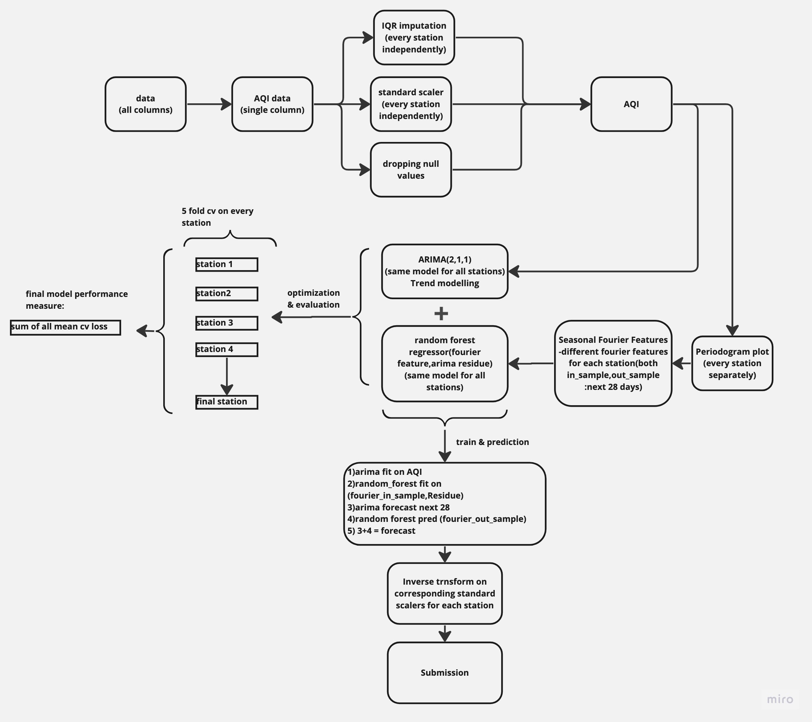

# 🌬️ Air quality index forecast for Indian cities

## About 
This project forecast the air quality index(AQI) of 40 stations across 6 Indian states

Developed as part of the h20.ai hackathon, this model secured the 🥉 3rd place on the Leader Board. 

## Metric
The MMAE (Modified Mean Absolute Error) is a statistical metric utilized to minimize the number of underestimations in air quality index forecasting for a given day. It is an effective tool for improving the accuracy of AQI predictions by reducing the occurrence of values that fall below the original estimates.

## Features
1. Time daummy features for trend modeling
2. Fourier features for season modelling
3. lag features from other correlated features

## Model
Model includes:
1. Arima(2,1,1) trained on trend (*decisions are explained in detail in [model.ipynb](model.ipynb)*) 📈
2. Random forest regressor trained and optimized on the season features 🌳

## Libraries
1. NumPy 
2. Pandas 
3. Statsmodels 
4. SciPy 
5. Scikit-learn 
6. Matplotlib & Seaborn 
7. wandb

 ## Design
